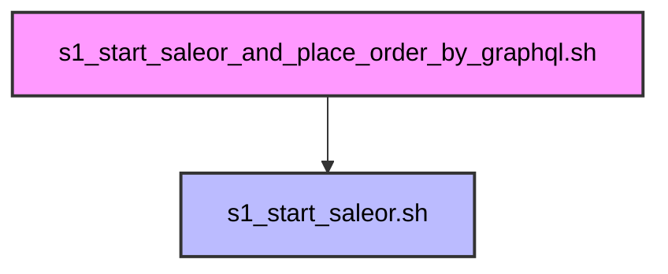
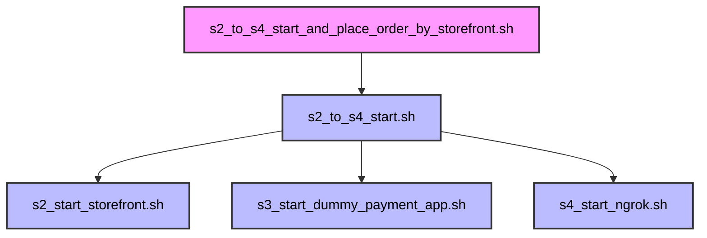

# Script Calling Relationship of s1 and s2

## Script Calling Relationship of s1_start_saleor_and_place_order_by_graphql.sh

## Script Calling Relationship of s2_to_s4_start_and_place_order_by_storefront.sh

