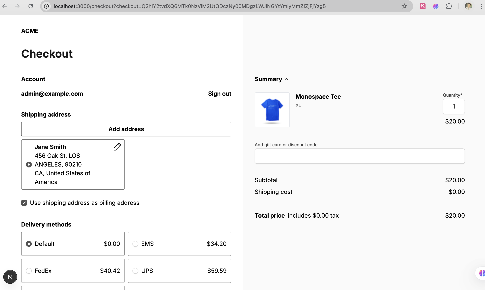

# Decision Table Testing AI Q&A

[https://docs.saleor.io/developer/discounts/overview](https://docs.saleor.io/developer/discounts/overview)

## Me: 

```markdown
请阅读下方关于Saleor电商平台折扣功能的文档，然后针对我上传的checkout页面中"添加礼品卡或折扣码"的结账场景，使用决策表设计测试用例，以全面覆盖常见的折扣应用场景。请先列出决策表设计的最佳实践，再基于这些实践设计决策表。最后根据决策表列出测试用例，只需提供测试名称、所需准备的数据（通过GraphQL设置的折扣策略）及其测试要点即可，无需生成代码。注意：因为只是演示AI生成决策表的场景，所以决策表无须将discounts的各种场景全部覆盖，而只须覆盖用户购物最常见的打折场景即可。以下是折扣功能的文档：【Discounts allow for the reduction of prices for selected variants, products, collections,
or categories by a given percentage or a fixed value. They can also decrease the value 
of subtotal and shipping price or grant a gift if certain conditions are met. 
## Classification
To better understand Saleor discounts and explain the terms used in this documentation, let's classify discounts
by type, level and value type.
### Type
There are three kinds of discounts in Saleor: [Promotions](developer/discounts/promotions.mdx), 
[Vouchers](developer/discounts/vouchers.mdx) and [Manual discounts](developer/discounts/manual-discounts.mdx).
The promotion discount is automatically applied to all products included in the promotion,
without requiring any additional actions from the user.
In contrast, voucher requires the customer to provide a code during the checkout process (or staff user during draft order process).
Lastly, Saleor offer manual discounts, which can be applied by staff users.
* [promotions](developer/discounts/promotions.mdx)
* [catalogue promotion](developer/discounts/promotions.mdx#catalogue-promotions)
* [order promotion](developer/discounts/promotions.mdx#order-promotions)
* [vouchers](developer/discounts/vouchers.mdx)
* [entire order](developer/discounts/vouchers.mdx#applying-the-entire-order-voucher)
* [specific product](developer/discounts/vouchers.mdx#applying-the-specific-product-voucher)
* [voucher applied to the cheapest line](developer/discounts/vouchers.mdx#applying-the-once-per-order-entire-order-voucher)
* [shipping](developer/discounts/vouchers.mdx#applying-the-shipping-voucher)
* [manual discounts](developer/discounts/manual-discounts.mdx)
* [manual order discount](developer/discounts/manual-discounts.mdx#manual-order-discount)
* [manual line discount](developer/discounts/manual-discounts.mdx#manual-line-discount)
### Level
We can distinguish discounts by the object they are associated with. 
Line-level discounts are applicable first, directly to the order line, and decrease the line [base prices](developer/price-calculation.mdx#discount-application).
Order-level discounts are associated with an order object, they decrease subtotal or shipping price, 
and next the discount is propagated to the order's lines. 
* line-level discounts
* [catalogue promotion](developer/discounts/promotions.mdx#catalogue-promotions)
* [specific product vouchers](developer/discounts/vouchers.mdx#applying-the-specific-product-voucher)
* [vouchers with applyOncePerOrder=True](developer/discounts/vouchers.mdx#applying-the-once-per-order-entire-order-voucher) 
* [shipping voucher](developer/discounts/vouchers.mdx#applying-the-shipping-voucher) (despite being associated with the order, 
and not with the order line, it decreases the [shipping base price](developer/price-calculation.mdx#discount-application), 
so should be considered as line-level discount)
* [manual line discount](developer/discounts/manual-discounts.mdx#manual-line-discount)
* order-level discounts
* [order promotion](developer/discounts/promotions.mdx#order-promotions)
* [entire order voucher](developer/discounts/vouchers.mdx#applying-the-entire-order-voucher)
* [manual order discount](developer/discounts/manual-discounts.mdx#manual-order-discount)
### Value Type
In general, discounts can take two forms:
* fixed - fixed amount, that is deducted from the original price
* percentage - percentage value of the original price】【】【】【】【】
```



## Claude with sonnet 4:

### 决策表设计最佳实践

#### 1. 决策表设计原则
- **完整性**：覆盖所有可能的条件组合
- **一致性**：避免相互矛盾的规则
- **简洁性**：避免冗余条件和动作
- **可理解性**：条件和动作描述清晰明确
- **可测试性**：每个规则都能转化为具体测试用例

#### 2. 条件识别策略
- 识别影响折扣应用的关键因素
- 区分输入条件和系统状态条件
- 考虑边界值和异常情况
- 优先覆盖最常见的业务场景

#### 3. 动作定义原则
- 明确预期的系统行为
- 包含正面和负面测试结果
- 考虑用户体验和错误处理

### 折扣码应用场景决策表
### 基于决策表的测试用例设计

#### 测试用例1：无折扣基准场景 (R1)
**测试名称**: `test_checkout_no_discounts_baseline`
**准备数据**: 
- 产品：Monospace Tee ($20.00)
- 无任何promotion或voucher设置
**测试要点**: 验证总价格保持$20.00，无折扣信息显示

#### 测试用例2：整单折扣券应用 (R2)
**测试名称**: `test_checkout_entire_order_voucher_success`
**准备数据**:
```graphql
voucherCreate(input: {
  type: "ENTIRE_ORDER",
  discountValueType: "PERCENTAGE", 
  discountValue: 10,
  minCheckoutItemsQuantity: 1,
  code: "SAVE10"
})
```
**测试要点**: 验证输入"SAVE10"后订单总价减少10%，显示折扣信息

#### 测试用例3：特定产品折扣券应用 (R3)
**测试名称**: `test_checkout_specific_product_voucher_success`
**准备数据**:
```graphql
voucherCreate(input: {
  type: "SPECIFIC_PRODUCT",
  discountValueType: "FIXED",
  discountValue: 5,
  code: "PRODUCT5"
})
voucherCataloguesAdd(products: ["Monospace Tee ID"])
```
**测试要点**: 验证输入"PRODUCT5"后该产品价格减少$5，其他产品不受影响

#### 测试用例4：目录促销+整单券组合 (R4)
**测试名称**: `test_checkout_catalogue_promotion_with_order_voucher`
**准备数据**:
```graphql
promotionCreate(input: {
  type: "CATALOGUE",
  rules: [{
    cataloguePredicate: {productPredicate: {ids: ["Monospace Tee ID"]}},
    rewardValueType: "PERCENTAGE",
    rewardValue: 15
  }]
})
voucherCreate(input: {
  type: "ENTIRE_ORDER",
  discountValueType: "FIXED",
  discountValue: 3,
  code: "EXTRA3"
})
```
**测试要点**: 验证先应用15%目录促销，再应用$3整单折扣，显示组合折扣效果

#### 测试用例5：目录促销+特定产品券组合 (R5)
**测试名称**: `test_checkout_catalogue_promotion_with_specific_voucher`
**准备数据**:
```graphql
promotionCreate(input: {
  type: "CATALOGUE",
  rules: [{
    cataloguePredicate: {productPredicate: {ids: ["Monospace Tee ID"]}},
    rewardValueType: "FIXED",
    rewardValue: 5
  }]
})
voucherCreate(input: {
  type: "SPECIFIC_PRODUCT", 
  discountValueType: "PERCENTAGE",
  discountValue: 20,
  code: "SPECIFIC20"
})
```
**测试要点**: 验证目录促销($5)和特定产品券(20%)组合应用效果

#### 测试用例6：运费折扣券应用 (R7)
**测试名称**: `test_checkout_shipping_voucher_success`
**准备数据**:
```graphql
voucherCreate(input: {
  type: "SHIPPING",
  discountValueType: "PERCENTAGE",
  discountValue: 50,
  code: "FREESHIP"
})
```
**测试要点**: 验证输入"FREESHIP"后运费减少50%，产品价格不变

#### 测试用例7：无效折扣码 (R8)
**测试名称**: `test_checkout_invalid_voucher_code`
**准备数据**: 无需创建voucher
**测试要点**: 验证输入"INVALID123"显示"无效折扣码"错误信息，价格不变

#### 测试用例8：过期折扣码 (R9)
**测试名称**: `test_checkout_expired_voucher_code`
**准备数据**:
```graphql
voucherCreate(input: {
  type: "ENTIRE_ORDER",
  discountValueType: "FIXED",
  discountValue: 10,
  endDate: "2023-01-01T00:00:00Z",
  code: "EXPIRED10"
})
```
**测试要点**: 验证输入过期码"EXPIRED10"显示"折扣码已过期"错误，价格不变

#### 测试用例9：产品不符合特定券条件 (R10)
**测试名称**: `test_checkout_product_not_eligible_for_specific_voucher`
**准备数据**:
```graphql
voucherCreate(input: {
  type: "SPECIFIC_PRODUCT",
  discountValueType: "FIXED", 
  discountValue: 5,
  code: "SHOES5"
})
voucherCataloguesAdd(products: ["Other Product ID"])
```
**测试要点**: 验证购物车中无符合条件产品时，显示"该折扣码不适用于购物车中的商品"

#### 测试用例10：不满足最小金额要求 (R12)
**测试名称**: `test_checkout_voucher_minimum_amount_not_met`
**准备数据**:
```graphql
voucherCreate(input: {
  type: "ENTIRE_ORDER",
  discountValueType: "FIXED",
  discountValue: 5,
  minAmountSpent: 50,
  code: "MIN50"
})
```
**测试要点**: 验证订单金额$20不满足$50最小要求时，显示"订单金额不满足使用条件"错误

### 测试执行策略

1. **优先级**: 按常见度排序执行，优先测试R1-R7核心场景
2. **数据隔离**: 每个测试用例使用独立的promotion/voucher数据
3. **清理策略**: 测试后清理创建的discount数据，避免相互影响
4. **边界测试**: 关注金额计算精度和舍入规则
5. **用户体验**: 验证错误信息的友好性和操作引导


## Checkout折扣码应用决策表

### 条件定义

| 条件编号 | 条件描述 | 可能值 |
|---------|---------|--------|
| C1 | 订单中是否有Catalogue Promotion | Y / N |
| C2 | 输入的折扣码类型 | ENTIRE_ORDER / SPECIFIC_PRODUCT / SHIPPING / INVALID / NONE |
| C3 | 折扣码状态 | VALID / EXPIRED / USAGE_LIMIT_REACHED / INACTIVE |
| C4 | 订单金额是否满足最小要求 | Y / N |
| C5 | 产品是否符合特定产品券条件 | Y / N / NA |

### 动作定义

| 动作编号 | 动作描述 |
|---------|---------|
| A1 | 显示折扣应用成功 |
| A2 | 更新订单小计金额 |
| A3 | 更新运费金额 |
| A4 | 显示促销组合效果 |
| A5 | 显示错误信息 |
| A6 | 保持原价格不变 |

### 决策表

| 规则 | R1 | R2 | R3 | R4 | R5 | R6 | R7 | R8 | R9 | R10 | R11 | R12 |
|------|----|----|----|----|----|----|----|----|----|----|----|----|
| **条件** |
| C1: 有Catalogue Promotion | N | N | N | Y | Y | Y | N | N | N | N | Y | N |
| C2: 折扣码类型 | NONE | ENTIRE_ORDER | SPECIFIC_PRODUCT | ENTIRE_ORDER | SPECIFIC_PRODUCT | SHIPPING | SHIPPING | INVALID | ENTIRE_ORDER | SPECIFIC_PRODUCT | ENTIRE_ORDER | ENTIRE_ORDER |
| C3: 折扣码状态 | NA | VALID | VALID | VALID | VALID | VALID | VALID | NA | EXPIRED | VALID | VALID | VALID |
| C4: 满足最小金额要求 | NA | Y | Y | Y | Y | NA | NA | NA | Y | N | Y | N |
| C5: 产品符合特定券条件 | NA | NA | Y | NA | Y | NA | NA | NA | NA | Y | NA | NA |
| **动作** |
| A1: 显示成功 | | ✓ | ✓ | ✓ | ✓ | ✓ | ✓ | | | | ✓ | |
| A2: 更新订单小计 | | ✓ | ✓ | ✓ | ✓ | | | | | | ✓ | |
| A3: 更新运费 | | | | | | ✓ | ✓ | | | | | |
| A4: 显示组合效果 | | | | ✓ | ✓ | ✓ | | | | | ✓ | |
| A5: 显示错误信息 | | | | | | | | ✓ | ✓ | ✓ | | ✓ |
| A6: 保持原价格 | ✓ | | | | | | | ✓ | ✓ | ✓ | | ✓ |

### 规则说明

- **R1**: 基准场景 - 无任何折扣
- **R2**: 仅使用整单折扣券
- **R3**: 仅使用特定产品折扣券
- **R4**: Catalogue Promotion + 整单折扣券组合
- **R5**: Catalogue Promotion + 特定产品折扣券组合
- **R6**: Catalogue Promotion + 运费折扣券组合
- **R7**: 仅使用运费折扣券
- **R8**: 无效折扣码
- **R9**: 过期折扣码
- **R10**: 产品不符合特定券条件
- **R11**: Catalogue Promotion + 整单券（满足条件）
- **R12**: 整单券不满足最小金额要求